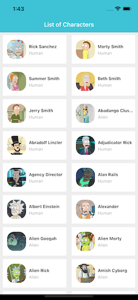

#  Rick and Morty - Test App

A MVP an app where you can review a list of all characters and retrieve information about the selected character.

##   Captures

### Characteristics

 - API characters List
 - Network Manager without third party depenencies
 - Asynchrously image loading
 - Lazy loading characters information
 - Combine Framework
 
### Pending
 - Multilanguage support with localizable strings
 - Reachability for network interruptions
 - Caching images for improve performance
 - Integation with SwiftUI 
 - UnitTest for service layer
 - Infinity scroll for home screen

### Credits
@fulviomoya - fulvio.127@gmail.com
